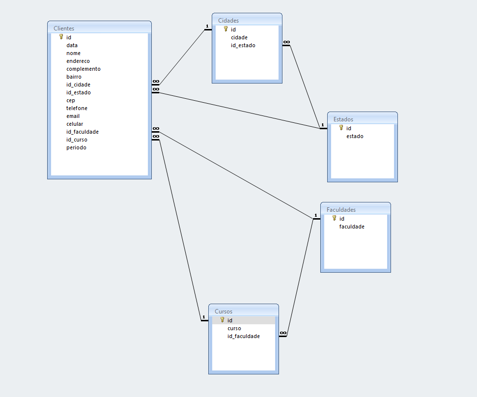

# **Trabalho N1 de Interação Humano-Computador 2022_1**
# *UEG - Campus Trindade*    

## *Versão 1 - 09/05/2022*

## O trabalho consiste em fazer duas interfaces de interação com o usuário.
- A primeira, deverá ser pouco agradável ou deficiente no quesito intuitiva e comunicativa, deixando o usuário com dúvidas e sem saber direito o que está acontecendo.
- A segunda, deverá ser uma interface amigável com muita informação e aspecto agradável ao usuário.

### Integrantes do grupo:
- Alexandre de Almeida Xavier.
- Hugo de Souza e Silva.
- Renato Fernandes Barreto.
- Pedro Henrique Pires Fabiano.
- Ricardo Hatsugai

### Ferramentas utilizadas para este projeto:
- Delphi 10.1 (Tokio-Trial).
- Microsoft Access 2019 (Modo de compatibilidade 2003).

### Entidades do banco de dados
### *Clientes*
  1. id (Número auto incremento primary key);
  2. data (data/hora);
  3. nome (texto);
  4. endereco (texto);
  5. complemento (texto);
  6. bairro (texto);
  7. id_cidade (número);
  8. id_estado (número);
  9. cep (texto);
  10. telefone (texto);
  11. email (texto);
  12. celular (texto);
  13. id_faculdade (texto);
  14. id_curso (texto);
  15. periodo (texto);

### *Estados*
  1. id (Número auto incremento primary key);
  2. estado (texto);

### *Cidades*
  1. id (Número auto incremento primary key);
  2. cidade (texto);
  3. id_estado (numero);

### *Faculdades*
  1. id (Número auto incremento primary key);
  2. faculdade (texto);

### *Cursos*
  1. id (Número auto incremento primary key);
  2. curso (texto);
  3. id_faculdade (numero);

### **Relacionamentos**

